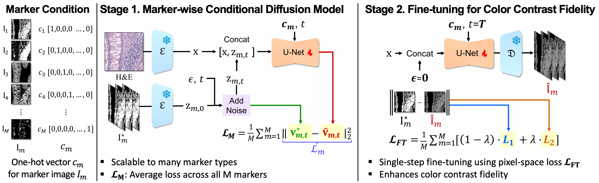

# Virtual Multiplex Staining for Histological Images using a Marker-wise Conditioned Diffusion Model

**AAAI 2026 Accepted**

This repository contains the official implementation of the paper:
> **Virtual Multiplex Staining for Histological Images using a Marker-wise Conditioned Diffusion Model**  
> Hyun-Jic Oh, Junsik Kim, Zhiyi Shi, Yichen Wu, Yu-An Chen, Peter K. Sorger, Hanspeter Pfister, Won-Ki Jeong 

## [Overview]



We propose a marker-wise conditioned latent diffusion framework that generates virtual multiplex (mIF/mIHC) marker channels directly from corresponding H&E images while sharing a single unified architecture across all markers.
The model supports marker-by-marker synthesis, accommodates heterogeneous marker intensity distributions, and is fine-tuned for single-step inference to improve both visual fidelity and runtime efficiency.

### Citation

If you find this work useful in your research, please consider citing our paper:
```
@article{oh2025virtual,
  title   = {Virtual Multiplex Staining for Histological Images using a Marker-wise Conditioned Diffusion Model},
  author  = {Oh, Hyun-Jic and Kim, Junsik and Shi, Zhiyi and Wu, Yichen and Chen, Yu-An and Sorger, Peter K and Pfister, Hanspeter and Jeong, Won-Ki},
  journal = {arXiv preprint arXiv:2508.14681},
  year    = {2025}
}
```
### To-do
- data loader
- training
- inference
- preprocessing/postprocessing parts

## Acknowledgements
Our implementation, training scripts, and evaluation pipelines heavily draw inspiration from [Marigold](https://github.com/prs-eth/Marigold) and [diffusion-e2e-ft](https://github.com/VisualComputingInstitute/diffusion-e2e-ft), and we gratefully acknowledge their authors for releasing high-quality code and models.
